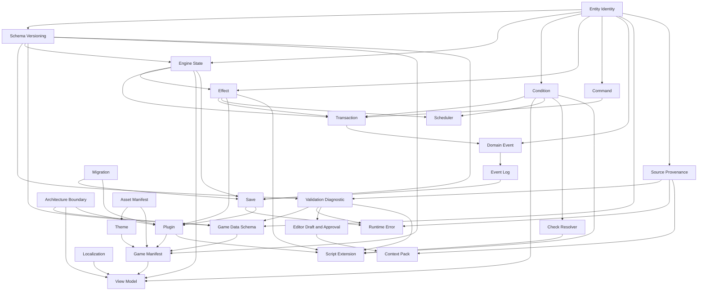

# Contract Dependency Order

This document recommends the order for drafting contracts after M0. It intentionally does not
define final schemas or implementations.

## M1 Minimal Foundation

The minimum foundation for M1 should be drafted in this order:

1. Entity Identity
2. Schema Versioning
3. Engine State
4. Condition
5. Effect
6. Command
7. Transaction
8. Domain Event
9. Validation Diagnostic

This preserves the requested order. The only nuance is that Validation Diagnostic is useful from
the beginning, but it can be drafted after the state and pipeline contracts because its first rule
IDs should name concrete contract failures.

## Recommended Full Draft Order

1. Entity Identity Contract
2. Schema Versioning Contract
3. Validation Diagnostic Contract
4. Source Provenance Contract
5. Architecture Boundary Contract
6. Engine State Contract
7. Condition Contract
8. Effect Contract
9. Command Contract
10. Transaction Contract
11. Domain Event Contract
12. Event Log Contract
13. Game Data Schema Contract
14. Game Manifest Contract
15. View Model Contract
16. Localization Contract
17. Migration Contract
18. Save Contract
19. Runtime Error Contract
20. Scheduler Contract
21. Check Resolver Contract
22. Theme Contract
23. Asset Manifest Contract
24. Plugin Contract
25. Script Extension Contract
26. Editor Draft and Approval Contract
27. Context Pack Contract

## Rationale

- Identity and schema versioning come first because nearly every other contract names entities or
  declares compatibility.
- Diagnostics and provenance should be early enough that future validation failures are structured
  and traceable.
- Engine State, Condition, Effect, Command, Transaction, and Domain Event form the minimal engine
  pipeline.
- Game Data, Manifest, View Model, and Localization are needed for the first headless vertical
  slice, but after the core mutation pipeline is defined.
- Save, plugins, scripts, editor workflow, assets, themes, and context packs are valid contracts but
  can wait until their owning milestones.

## Dependency Graph

## M1 Exclusions

Do not draft implementation tasks for Scheduler, Save, Plugin, Script Extension, Asset, Theme, or
Editor workflow during M1 unless a later ADR or milestone task explicitly changes scope.

## M3 Next-Step Order

After M2 gate acceptance and M3 planning acceptance, the next contract drafting order should begin
with:

1. Content Package Contract
2. Content schema and version manifest
3. Content validation diagnostic adapters
4. Content package cross-reference validation
5. Validated content graph and loader boundary contract

Rationale:

- Content Package Contract establishes the neutral package envelope before schema-specific or loader
  work begins.
- Schema and manifest details should follow the package boundary rather than inventing content
  loader behavior first.
- Diagnostic adapters should be defined before cross-reference validation so later validators can
  emit stable content-domain diagnostics without redesigning the reporting boundary.
- Loader work must remain downstream from validated package shape and diagnostics.
